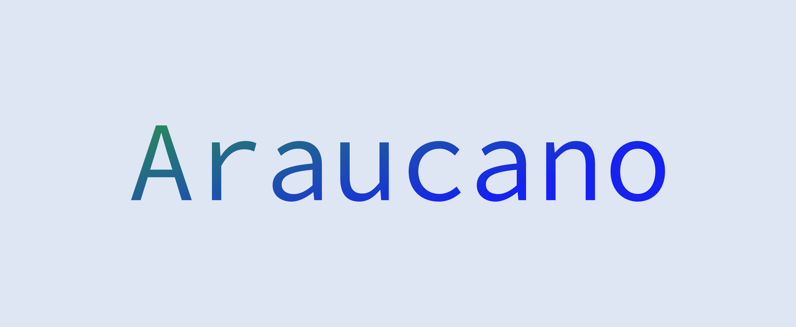
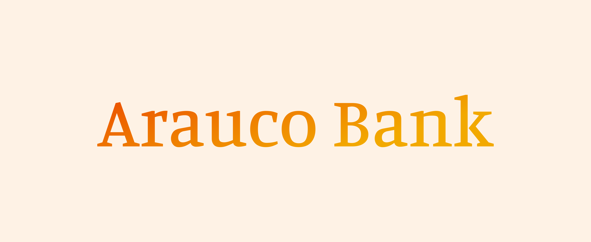

# Araucano

<figure><figcaption>
Araucano - The Open Finance Layer
</figcaption></figure>

**Araucano is the layer for Decentralized Open Finance focused in developing countries, to enable Fintechs with Blockchain apps, to bring Web3 to the next billion people and companies.**

### Arauco Chain

An enterprise-grade Open Finance network for developing countries focused on FinTechs and financial institutions, compatible with the ISO 20022 standard for interoperability.

<figure><figcaption></figcaption></figure>

### Arauco Bank

**On-chain neo-bank for individuals and businesses to make financial transactions.**

Built on top of the Arauco Chain for enterprises, people, RWA Issuers, and more, in a gasless experience.

**The first version will be released in the first half of 2025.**

<figure><figcaption></figcaption></figure>

### PeerPay

**Web payment system with the advantages of Web 3.0 and the ease of use of Web 2.0.**

With PeerPay, users can manage different wallets, make cross-border transactions in any currency, Integrate payments into their platforms, and more.

**The first version will be released in the last quarter of 2024.**

<figure><figcaption></figcaption></figure>
