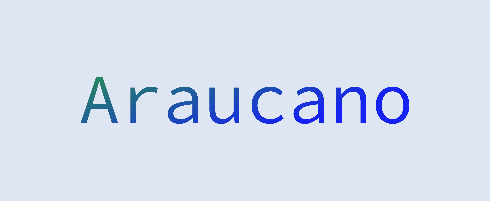

# Araucano

<figure><figcaption>
Araucano - The Open Finance Layer
</figcaption></figure>

**Araucano is the layer for Decentralized Open Finance focused in developing countries, to enable Fintechs with Blockchain apps, to bring Web3 to the next billion people and companies.**

### Arauco Chain

An enterprise-grade Open Finance network for developing countries focused on FinTechs and financial institutions, compatible with the ISO 20022 standard for interoperability.

<figure><figcaption></figcaption></figure>

The goal of Arauco Chain is to be a highly available, efficient, and economical network so that Fintechs can develop their products and services in a flexible and fast way, to provide their users and clients with better financial opportunities.

With Arauco Chain, you can create:

* Decentralized and centralized exchange platforms.
* Payment and remittance systems.
* Stablecoins and Central Bank Digital Currencies.
* Real Asset Tokenization (RWA).
* Financial compliance systems.
* Loan systems.
* Invoice management.
* And much more.

###

