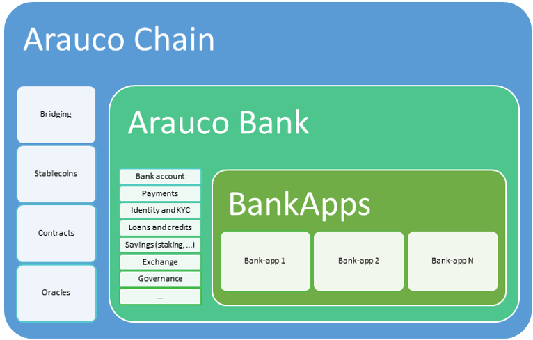

# Architecture

Below is a summary of Arauco Bank's architecture and its main modules:

<figure><figcaption>
Arauco Bank architecture
</figcaption></figure>

### Modules

* **Bank account**: Wallets that support both cryptocurrencies and traditional currencies (through stablecoins or integrations with traditional banks).
* **Payments**: Fast, interoperable, and economical transactions thanks to Arauco Chain.
* **Identity and KYC**:
  * **Decentralized Identity (DID)**: Allows users to control their identity without relying on intermediaries, using standards such as DID or verifiable credentials (VC).
  * **Blockchain-based KYC**: Allows customers to verify their identity once, with secure access for other authorized entities.
* **Loans and credits**: Implementation of DeFi protocols to offer collateral-based or non-collateralized loans and credits.
* **Savings**: Offer competitive interest rates by participating in DeFi protocols.
* **Exchange**: Integration to convert coins or tokens directly into other assets.
* **Governance**: Community management of the bank, through a governance token (_ABANK_), to vote on issues such as integrating bank-apps, among others.

### BankApps

Mini applications (or standalone) that will be integrated into Arauco Bank through APIs or Smart contracts, so that the bank's clients can access on-chain services transparently and without leaving the bank's interface.
