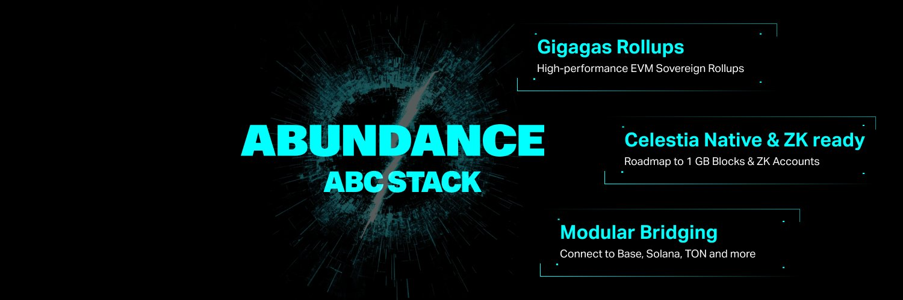

# Technologies

Arauco Chain uses leading and innovative technologies to bring Open Finance in a decentralized way.

**Below are the technologies for the Devnet (they might be different for the testnet, and will be notified as soon as we launch the new network):**

### Devnet Technologies



Arauco Chain is being built on ABC Stack ([https://www.abundance.xyz/](https://www.abundance.xyz/)), to be a sovereign network, high performance (more than 50,000 transactions/second), compatible with EVM, and interoperable with other Blockchain networks in a modular way, allowing the development of all types of financial applications in an agile and economical way.

<figure><figcaption>
Abundance ABC Stack
</figcaption></figure>



We leverage the benefits and high-performance infrastructure of Gelato Network ([https://www.gelato.network/](https://www.gelato.network/)) for our Blockchain, allowing us to focus on what is important: developing financial solutions.

<figure><figcaption>
Gelato Network
</figcaption></figure>



Araucano and all products will be able to connect to non-blockchain financial networks thanks to the Interledger Protocol ([https://interledger.org/](https://interledger.org/)).

<figure><figcaption></figcaption></figure>



